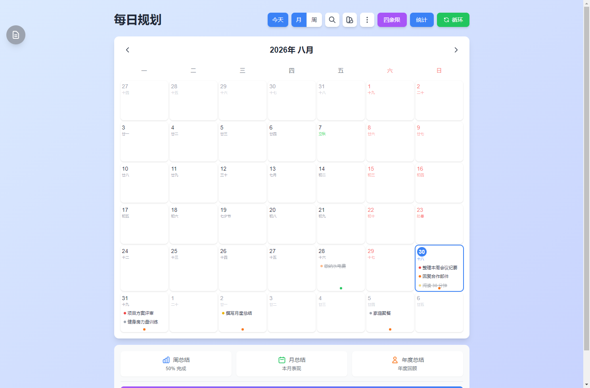
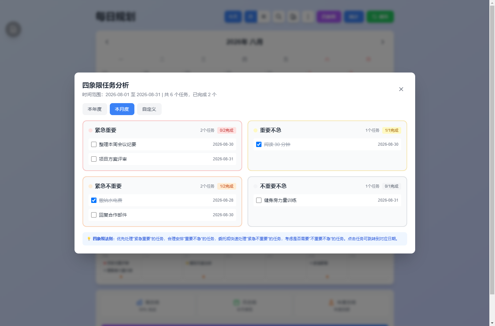
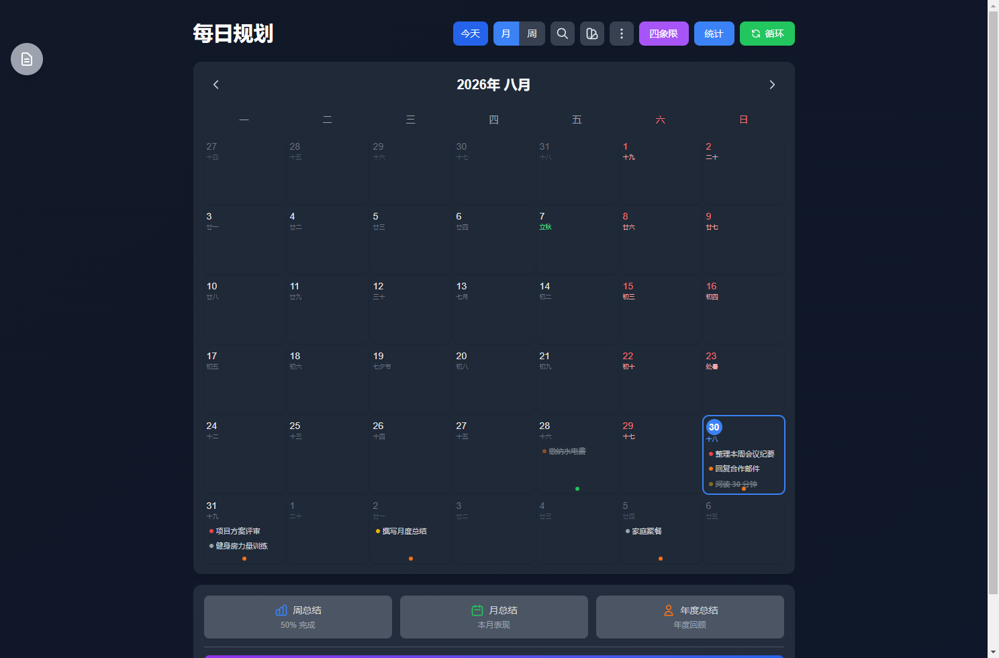

<div align="center">


# 每日规划 Daily Planner

**简洁高效的中文桌面任务管理：日历 + 四象限 + 知识库，数据完全留在本机。**

[English](README.en.md) · 简体中文

[](https://github.com/tuweihuasheng/daily-planner/releases)
[](LICENSE)
[](#)
[](#)
[](#)

[下载安装](#快速开始) · [功能总览](#功能总览) · [数据与隐私](#数据与隐私) · [从源码构建](#从源码构建) · [FAQ](#faq)

</div>

---

## 这是什么

**每日规划**是一款为中文用户打造的桌面任务管理工具，把日历、待办、四象限分析和个人知识库装进一个轻量的窗口。它不要求注册账号，不把你的任务同步到任何云端——所有数据都保存在你自己的电脑里。

适合这样的你：

- 🗓️ 想要一个**带农历和法定节假日**的桌面日历，安排日程时不用再查另一个网站
- 🎯 事情多到理不清，需要**四象限法则**帮你分清轻重缓急
- 🔒 在意隐私：任务、备忘录、知识库图片**只存在本机**，不经过任何服务器
- 🇨🇳 希望界面、交互、节假日数据全部**原生中文**，而不是翻译过来的

## 截图

| 月视图（农历 + 节假日 + 任务） | 四象限任务分析 |
|:---:|:---:|
|  |  |

| 深色模式 |
|:---:|
|  |

## 功能总览

### 🗓️ 日历与日程
- **月 / 周视图**，`/` 一键搜索，今天、待办提醒随手直达
- **农历显示** + **中国大陆法定节假日**（内置官方数据，离线可用）
- **纪念日提醒**：支持公历 / 农历生日与纪念日
- **循环日程**：按周 / 按月重复的固定日程，自动铺进日历

### 🎯 四象限任务管理
- 每条任务按 **紧急重要 / 重要不急 / 紧急不重要 / 不重要不急** 归类，优先级颜色贯穿日历视图
- 四象限分析弹窗按本年 / 本月 / 自定义区间统计完成率，点击任务直接跳转对应日期
- **标签体系**：预设 + 自定义彩色标签，拖拽排序；支持按优先级 / 时间 / 状态排序

### 🔔 智能提醒

任务按优先级提前提醒：

| 优先级 | 提前天数 |
|--------|----------|
| 高优先 | 7 天 |
| 中优先 | 5 天 |
| 低优先 | 3 天 |

纪念日提前 3 天提醒。

### 📚 个人知识库与备忘录
- 知识库支持**图片上传与缩放查看**，任务可关联知识条目
- 备忘录支持**全文搜索**
- **周总结 / 月总结 / 年度总结**：自动统计完成率，回顾更有据

### 🎨 桌面体验
- **深色模式** + 5 种背景主题
- 系统托盘常驻、无边框自定义窗口
- **JSON / CSV 导入导出**（含图片打包），换电脑不丢数据

### ⌨️ 快捷键

| 快捷键 | 功能 |
|--------|------|
| `/` | 打开搜索（应用内） |
| `Ctrl + Enter` | 添加任务（输入框内） |
| `Escape` | 关闭弹窗/面板 |
| `Ctrl + Shift + P` | 显示/隐藏主窗口（全局） |
| `Ctrl + Shift + N` | 快速添加任务（全局） |
| `Ctrl + Shift + T` | 跳转到今天（全局） |

## 快速开始

### 方式一：下载安装包（推荐）

- [GitHub Releases](https://github.com/tuweihuasheng/daily-planner/releases)
- [Gitee Releases](https://gitee.com/europe-and-oceania/daily-planner/releases)（国内推荐）

下载 `daily-planner-setup-<版本>.exe`，双击安装即可（Windows 10 / 64 位及以上）。应用内置自动更新，新版本发布后会提示一键升级。

### 方式二：从源码构建

需要 [Node.js](https://nodejs.org) 20+ 和 [pnpm](https://pnpm.io) 9+：

```bash
git clone https://github.com/tuweihuasheng/daily-planner.git
cd daily-planner
pnpm install
pnpm electron:dev    # 开发模式
pnpm electron:build  # 打包 Windows 安装包（输出到 dist-electron/）
```

## 数据与隐私

- 任务、纪念日、循环日程保存在应用本地存储；知识库与备忘录保存在系统用户数据目录（`%APPDATA%\daily-planner`）下的 JSON 文件
- **没有账号体系，没有任何遥测**，应用不向任何服务器发送你的数据
- 版本检查只读取 Release 页面的版本号元数据
- 迁移数据：应用内导出 JSON / ZIP，在另一台机器导入即可（知识库图片会一起打包）

## 自动更新

应用通过 [electron-updater](https://www.electron.build/auto-update) 检查更新，GitHub Releases 与 Gitee 双源可用。推送 `v*` 标签时，GitHub Actions 会自动构建安装包并发布 Release（见 [build-unsigned.yml](.github/workflows/build-unsigned.yml)）。安装包当前未做代码签名，首次运行如遇 SmartScreen 提示，选择「仍要运行」即可。

## 从源码开发

```bash
pnpm dev            # 仅前端（浏览器预览）
pnpm electron:dev   # 完整 Electron 开发模式
pnpm build          # 构建前端
pnpm electron:build # 打包安装包
pnpm ts-check       # TypeScript 类型检查
pnpm lint           # ESLint
```

技术栈：Electron 22 · TypeScript 5.6 · Vite 7 · Tailwind CSS 3 · lunar-javascript

```
daily-planner/
├── electron/    主进程（窗口、托盘、更新、数据文件）
├── src/         渲染进程（单页 TypeScript 应用）
├── scripts/     辅助脚本（README 截图、平台集成）
└── docs/        README 截图
```

## FAQ

**Q：数据会上传到云端吗？**
不会。所有数据只保存在本机；应用甚至没有登录功能。

**Q：换电脑怎么迁移？**
旧机器导出（JSON / ZIP），新机器导入即可。知识库图片会一起打包。

**Q：支持 macOS / Linux 吗？**
目前仅提供 Windows 安装包；欢迎社区贡献其他平台的打包配置。

**Q：节假日数据会过期吗？**
内置了官方节假日数据且支持在线刷新缓存，后续年份会跟进更新。

**Q：杀毒软件报毒 / SmartScreen 拦截？**
安装包未做代码签名（个人项目成本原因），属于误报范畴，也可以从源码自行构建。

## 作者

**严辉村高斯林** · 产品：土味花生

## 许可证

[MIT](LICENSE) © 严辉村高斯林 & daily-planner contributors
